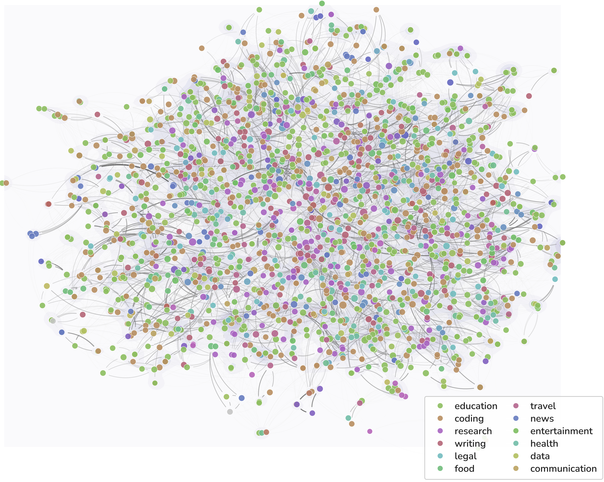

<h1 align="center">Synthetic Interaction Data for Scalable Personalization in Large Language Models</h1>

<p align="center">
  <a href="https://personagym.readthedocs.io/"></a>
  <a href="https://github.com/yccm/LLM-PPOpt"></a>
  <a href="https://huggingface.co/datasets/HowieHwong/PPOpt-data"></a>
  <a href="https://huggingface.co/HowieHwong/ppopt"></a>
  <br>
  
  
  
</p>

<p align="center">
  <a href="#overview">Overview</a> •
  <a href="#personagym">PersonaGym</a> •
  <a href="#ppopt-training">PPOpt Training</a> •
  <a href="#installation">Installation</a> •
  <a href="#citation">Citation</a>
</p>

---

## Overview

PyTorch Implementation on Paper [KDD 2026] [Synthetic Interaction Data for Scalable Personalization in Large Language Models](https://arxiv.org/pdf/2602.12394)

This repository contains two main components:

1. **PersonaGym**: A synthetic data generation framework for creating high-fidelity, multi-turn personalized interaction trajectories
2. **PPOpt Training**: A reinforcement learning-based method for training personalized prompt optimizers

**Resources:**
- Dataset: [PersonaAtlas on HuggingFace](https://huggingface.co/datasets/HowieHwong/PPOpt-data)
- Model: [PPOpt on HuggingFace](https://huggingface.co/HowieHwong/ppopt)

---

## PersonaGym

<p align="center">
  
</p>

PersonaGym is a framework for generating **PersonaAtlas**, a large-scale, high-quality, and diverse synthetic dataset of personalized user-LLM interactions.

**📚 Documentation**: [https://personagym.readthedocs.io/](https://personagym.readthedocs.io/)  
**💻 Code**: [https://github.com/yccm/LLM-PPOpt](https://github.com/yccm/LLM-PPOpt)

### Key Features

- **Persona Bank**: Multi-dimensional user profiles (demographics, expertise, communication preferences, latent constraints)
- **Interaction Simulation**: Three-agent pipeline (User, Assistant, Distractor) for realistic trajectories
- **Partial Observability**: Mirrors real-world sparsity by sampling observable features
- **Noise Injection**: Distractor model adds lexical, semantic, structural, and logical noise for robustness

### PersonaAtlas Visualization

<p align="center">
  
</p>

The visualization above shows conversation-level embeddings from PersonaAtlas colored by domain. The data points are broadly interleaved rather than forming distinct clusters, indicating substantial semantic overlap across domains. This demonstrates that domain identity is not the dominant factor in the representation structure, which is intended by design to capture rich, multi-dimensional persona characteristics beyond simple domain categorization.

### Usage

```bash
# Generate full dataset
python run.py --num-personas 100

# Generate specific stage
python run.py --stage persona --num-personas 100
python run.py --stage interaction --num-personas 10

# Skip distractor noise
python run.py --skip-distractor --num-personas 20
```

---

## PPOpt Training

PPOpt (Personalized Prompt Optimizer) learns to optimize user prompts based on interaction history and latent preferences. The model employs a two-stage reasoning-then-optimization approach: first inferring user preferences from history, then generating optimized prompts. Training combines supervised fine-tuning and multi-objective reinforcement learning (GRPO) with profile inference and task outcome rewards.

**Training code will be released in the `training/` directory.**

---

## Installation

```bash
# Clone the repository
git clone https://github.com/yccm/LLM-PPOpt.git
cd LLM-PPOpt

# Install dependencies
pip install -r requirements.txt

# Configure API keys in config.yaml
```

---

## Project Structure

```
LLM-PPOpt/
├── config.yaml              # Configuration file
├── run.py                   # Data generation entry point
├── src/                     # PersonaGym implementation
├── input/                   # Persona bank, seed queries, noise strategies
├── prompts/                 # LLM prompt templates
├── output/                  # Generated datasets
├── analysis/                # Token usage analytics
└── training/                # PPOpt training code (coming soon)
```

---

## Citation

If you use this work, please cite:

```bibtex

@inproceedings{ma2026synthetic,
  title={Synthetic Interaction Data for Scalable Personalization in Large Language Models},
  author={Ma, Yuchen and Huang, Yue and Wang, Wenjie and Luo, Xiaonan and Zhang, Xiangliang and Feuerriegel, Stefan},
  booktitle={ACM SIGKDD Conference on Knowledge Discovery and Data Mining},
  year={2026}
}
```

---

## License

This project is licensed under the MIT License.
