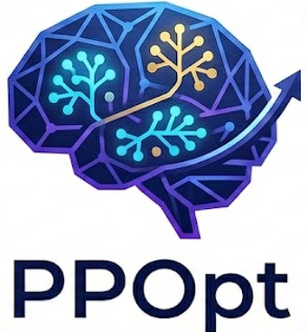

<p align="center">
  
</p>
<p align="center">
  <a href="https://personagym.readthedocs.io/"></a>
  
  
</p>


<h3 align="center">Personalized Prompt Optimization via Synthetic Interaction<br/>Trajectories and Latent Preference Learning</h3>

<p align="center">
  <a href="#overview">Overview</a> •
  <a href="#methodology">Methodology</a> •
  <a href="#installation">Installation</a> •
  <a href="#usage">Usage</a>
</p>

---

## Overview

Personalized prompting has emerged as a critical capability for large language models (LLMs), yet existing prompt optimization methods primarily focus on task-level optimization, largely overlooking user-specific preferences and latent constraints. **PPOpt** addresses this gap by proposing a principled framework that learns to optimize user prompts based on their interaction history and latent preferences.

### Key Contributions

1. **High-Fidelity Synthetic Data Generation**: A principled framework for generating personalized user-LLM interaction trajectories, modeling users as evolving preference processes rather than static personas.

2. **Reasoning-then-Optimization Policy**: A reinforcement learning-based personalized prompt optimizer that first infers latent user profiles from interaction history, then generates improved prompts conditioned on the inferred profile.

3. **Outcome-Driven Multi-Objective RL**: Optimization guided by task-level outcome rewards rather than surface-level prompt matching, mitigating shortcut learning and improving generalization.

### Why PPOpt?

- **Efficiency**: No need to fine-tune the base LLM per user
- **Accessibility**: Works with closed-source LLMs via API access
- **Model-Agnostic**: Decouples personalization from model training
- **Privacy-Preserving**: Synthetic data generation avoids privacy-sensitive real user data

---

## Methodology

### System Architecture

```
┌──────────────────────────────────────────────────────────────────────────────┐
│                    High-Fidelity Synthetic Data Generation                   │
│                                                                              │
│  ┌─────────────┐    ┌─────────────┐    ┌─────────────┐    ┌─────────────┐   │
│  │   Persona   │    │ Preference  │    │ Interaction │    │  Distractor │   │
│  │    Bank     │ -> │    Spec     │ -> │  Synthesis  │ -> │   Model     │   │
│  │     𝒫       │    │  Compiler   │    │             │    │   M_dist    │   │
│  └─────────────┘    └─────────────┘    └─────────────┘    └─────────────┘   │
└──────────────────────────────────────────────────────────────────────────────┘
                                    │
                                    v
┌──────────────────────────────────────────────────────────────────────────────┐
│                      PPOpt: Personalized Prompt Optimizer                    │
│                                                                              │
│                    ┌─────────────────────────────────┐                       │
│                    │   Reasoning-then-Optimization   │                       │
│                    │                                 │                       │
│   (q̃_init, ℋ_u) ──>│   π_θ(ẑ_u, q̂_init | s_u)       │──> (ẑ_u, q̂_init)     │
│                    │                                 │                       │
│                    └─────────────────────────────────┘                       │
│                                    │                                         │
│                    ┌───────────────┴───────────────┐                         │
│                    v                               v                         │
│            ┌─────────────┐                 ┌─────────────┐                   │
│            │  Cold-Start │                 │ Outcome-RL  │                   │
│            │     SFT     │ ─────────────>  │   (GRPO)    │                   │
│            └─────────────┘                 └─────────────┘                   │
└──────────────────────────────────────────────────────────────────────────────┘
```

### Persona Bank and Preference Specification

The Persona Bank `𝒫` contains structured user profiles with multi-dimensional features:

| Category | Examples |
|----------|----------|
| **Demographic Attributes** | Age, profession, education level, geographic location |
| **Domain Expertise** | Technical proficiency, domain-specific knowledge areas |
| **Communication Preferences** | Verbosity, formality, preferred response structure |
| **Latent Constraints** | Privacy concerns, ethical boundaries, content restrictions |

**Partial Observability**: To mirror real-world sparsity, we sample an observed subset of features `o ~ Sample(p; π_mask)` where `o ⊆ p`.

### Personalized Interaction Simulation

The pipeline employs three LLM agents:
- **User Model** (`M_user`): Produces user-like queries and feedback
- **Assistant Model** (`M_asst`): Responds to queries
- **Distractor Model** (`M_dist`): Injects realistic noise (lexical, semantic, structural, logical) for robustness

### Reasoning-then-Optimization Policy

The optimizer follows a two-stage paradigm:
1. **Profile Inference**: Infer latent user preferences `ẑ_u` from history `ℋ_u`
2. **Prompt Generation**: Generate improved prompt `q̂_init` conditioned on `ẑ_u`

### Multi-Objective Reinforcement Learning

The reward function combines two objectives:
```
R_u(θ) = λ_prof · r_prof(u) + λ_task · r_task(u)
```
- **Profile Inference Reward**: How well the inferred profile matches the true persona
- **Task Outcome Reward**: Pairwise preference-aware evaluation of response quality

---

## Installation

```bash
# Clone the repository
git clone https://github.com/your-repo/PPOpt.git
cd PPOpt

# Install dependencies
pip install -r requirements.txt

# Configure API keys in config.yaml
```

---

## Usage

```bash
# Run full data generation pipeline
python run.py --num-personas 100

# Run specific stage
python run.py --stage persona --num-personas 100
python run.py --stage interaction --num-personas 10

# Skip distractor noise injection
python run.py --skip-distractor --num-personas 20
```

---

## Project Structure

```
PPOpt/
├── config.yaml              # Main configuration
├── run.py                   # Entry point
├── src/                     # Core implementation
├── input/                   # Persona bank, seed queries, noise strategies
├── prompts/                 # LLM prompt templates
├── output/                  # Generated datasets
└── analysis/                # Token usage analytics
```

---

## License

This project is licensed under the MIT License.
